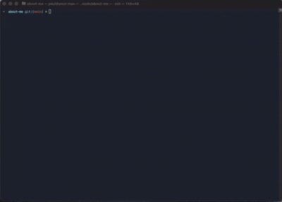

# sonarqube_prep


SonarQube_prep is a helper application meant to make it easier to prepare projects, that are provisioned in SonarQube already, to have the needed files and information to show information.
It will not provision a project in SonarQube for you. This should be done with more control from the UI itself.

## Running 

```bash
npx sonarqube_prep
```
On a first run, you will be asked to provide a url for your sonarqube instance and a token.
The URL must be provided, the token is optional.
This information will be stored locally only in `~/.sonarqube_prep`

Questions asked:  
- provide the default branch name (default is collected but can be overriden)
- provide the Project Key (must match the project key in SonarQube)
- provide the token for the badges (must match the token as seen in the project info in SonarQube)
- select the badges you want to add to the README.md 
- Confirm if you would like to create a GHA for SonarQube

***

***

### Output

As a result, the README.md file will have the badges selected added to the top of the file.
A `sonar-project.properties` will be created, along with a `.github/workflows/sonarqube-build.yml` if opted in. 
Not wanting the GHA will show a short snippet that can be used in a different action yml file.

### Manually left to do:

The `sonar-project.properties` will only contain the project_key, nothing else.
You will stil have to set exceptions, inclusions, or exclusion if you wish to do so, specify python versions, or the location of a `coverage.xml` file.

### Why

I found it troublesome and error prone to setup multiple repositories and always having to remember where what information comes from.
When supplying the `token` it really speeds things up by getting all the needed information for you.


## local development

```bash
npm install
```

To run:

```bash
npm run lib/index.ts
```

## build

```bash
npm run build
```

## publish 

```bash 
npm run publish
```

